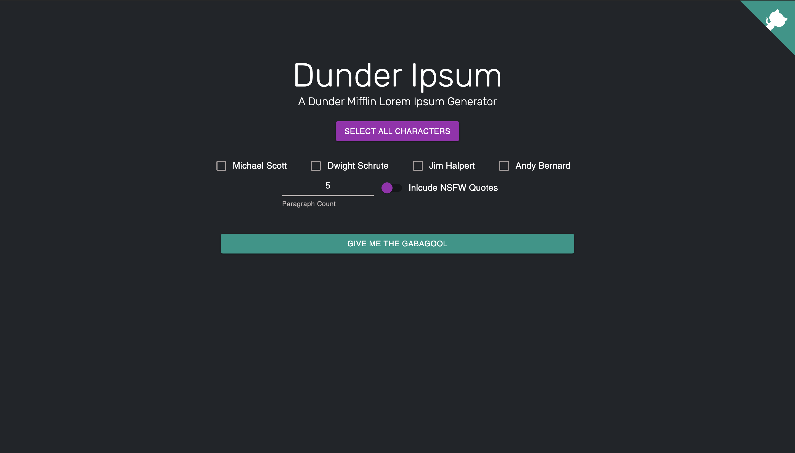
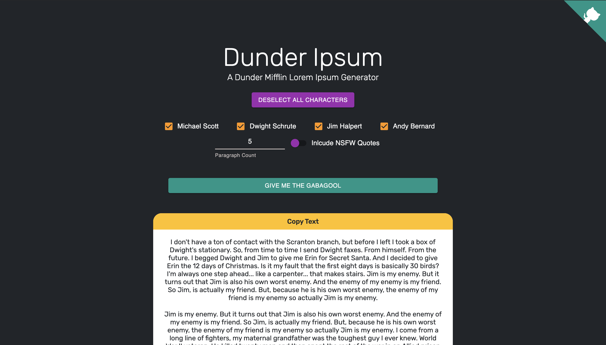

# Dunder Ipsum

##### A Dunder Mifflin Lorem Ipsum Generator

⚠️ Work In Progrss - Awaiting AWS Deployment ⚠️

###### App Homepage



###### App with Dunder Ipsum Text



### Technologies Used:

- React
- Redux
- Material UI
- NodeJS
- MongoDb
- AWS _(for auto scaled EC2 deployment)_

### How It Works

On page load, the app will identify all the unique characters quoted in the database and dynamically generate character checkbox options for each one. This way if a quote from a new characters is added to the database, the site will automatically update the character checkboxes. The user selects the following options: characters to pull quotes from, the number of ipsum paragraphs to generate and whether or not to include NSFW quotes. Once the user clicks the `Give me the Gabagool` button, the app will query the database and pull all quotes from the selected characters. The order of the quotes are then randomized, and appended together to make paragraphs with a minimum of 500 characters each. The number of paragraphs requested are then returned to client, and displayed to the user. The user can then click the `Copy to Clipboard` button to copy the returned ipsums to their clipboard.

### Adding Quotes to Database

To add a quote to the database, make a post request to `/api/new` with the following request body format:

```
{
	"quote": <QUOTE TO SAVE>,
	"character": <CHARACTER WHO SAID QUOTE>,
	"NSFW": <BOOLEAN - IF NSFW>
}
```

_Note: Your request must also include an Authorization header set to the `DB_ADD_ADMIN_KEY` environment variable._
